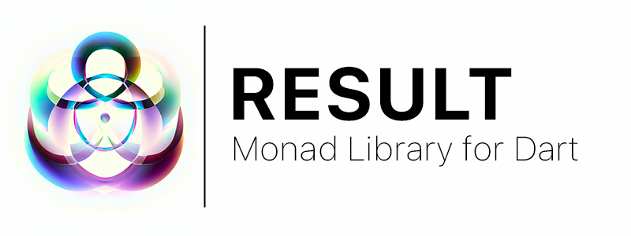

### Hi 👋 I'm Hugo, 

I'm a software engineer from France 🇫🇷. I'm currently working at [Wyatt Studio](https://wyatt-studio.fr) as a software engineer. I'm passionate about mobile development, software design and architecture, and open source. I'm also a big fan of [Flutter](https://flutter.dev) and [Dart](https://dart.dev).

* 📫 How to reach me: **Email** or **LinkedIn**

---

<h5>Projects</h5>

